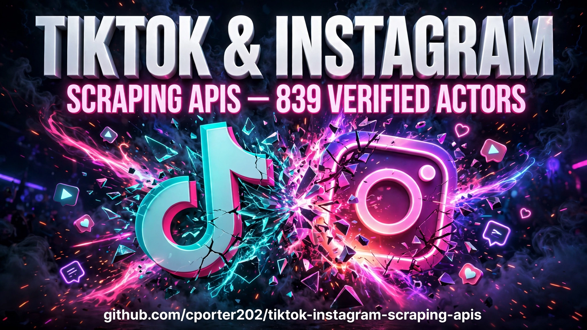

 

# 🎵 TikTok & Instagram Scraping APIs

**Research viral content programmatically. 839 scraping actors for TikTok videos, Instagram reels, hashtags, trends, and profiles — powered by production-ready Apify actors.**

  <a href="catalog/README.md"><strong>🔍 Browse the Actor Catalog</strong></a> ·
  <a href="#-start-with-a-job-to-be-done"><strong>🚀 Start Building</strong></a> ·
  <a href="https://apify.com?fpr=p2hrc6"><strong>⚡ Try Apify Free</strong></a>

## 📖 What this repo is

A mega directory of **839 TikTok & Instagram scraping APIs** — the largest niche collection of its kind. Scrape viral videos, track trending hashtags, analyze competitor profiles, monitor comments, and build the datasets that power creator tools, trend dashboards, and content research. Every actor is a ready-to-run [Apify](https://apify.com?fpr=p2hrc6) worker.

The main content of this repository:

- [🔍 Browse the actor catalog](catalog/README.md) — 839 actors across TikTok videos, hashtags, Instagram reels, profiles, followers, and engagement.

| Coverage snapshot | This directory |
|---|---:|
| 🎵 Verified TikTok + IG actors | **839** |
| 🎵 TikTok scrapers | **349** |
| 📸 Instagram scrapers | **402** |
| 🗂️ Cross-platform & general | **88** |
| Starting cost | **Free tier + pay-per-result** |

## 🎯 Start with a job to be done

| If you need to… | Start here |
|---|---|
| 🔥 Find what's going viral in your niche right now | [Viral trend research playbook](playbooks/viral-trend-research.md) |
| 🎬 Scrape TikTok videos + stats in bulk | [Actor catalog](catalog/README.md) → TikTok profile & video scrapers |
| 📸 Pull Instagram reels, profiles & hashtags | [Actor catalog](catalog/README.md) → Instagram sections |
| 🤖 Feed social data to an AI content agent | [Creator intel playbook](playbooks/creator-intel-pipeline.md) |

## 🛠️ Common build paths

- **🔥 Viral trend research** — scrape trending hashtags daily, rank by velocity, spot formats before they peak. The [playbook](playbooks/viral-trend-research.md) sets it up.
- **🕵️ Competitor content analysis** — track rival creators' posting cadence, formats, and engagement; reverse-engineer what works.
- **📊 Creator vetting for brands** — pull real follower counts, engagement rates, and audience signals before you pay for a sponsorship.
- **🤖 AI content agents** — feed fresh TikTok/IG data into agents that write hooks, scripts, and content calendars from what's actually working.

## 🌟 Featured actors

| Actor | Why it stands out |
|---|---|
| TikTok profile & video scrapers | The highest-volume category — 296 actors for profiles, videos, and user data |
| Instagram profile & post scrapers | 350 actors covering profiles, posts, media, and timelines |
| Hashtag & trend trackers | 73 actors for spotting trends across both platforms |

[See all 839 in the catalog →](catalog/README.md)

## ❓ Why actors instead of the official APIs

TikTok and Instagram's official APIs are gated, rate-limited, and missing most of the data creators actually want. These actors pull public data at scale — video stats, comments, hashtags, profiles — with proxy rotation and maintenance handled for you. You get clean JSON; they handle the blocks.

  <a href="https://apify.com?fpr=p2hrc6"><strong>⚡ Get started on Apify (free tier) →</strong></a>

## 🤝 Contributing

Found a TikTok or Instagram actor that belongs here? Open a PR adding it to `catalog/README.md` with a verified `apify.com` URL and a one-line description. Only actors confirmed live on the Apify Store, please.

## 📢 Disclosure

Links to Apify in this repo include my affiliate code (`fpr=p2hrc6`). You pay exactly the same price — it supports keeping this directory updated and verified.

## 📄 License

MIT — see [LICENSE](LICENSE).
